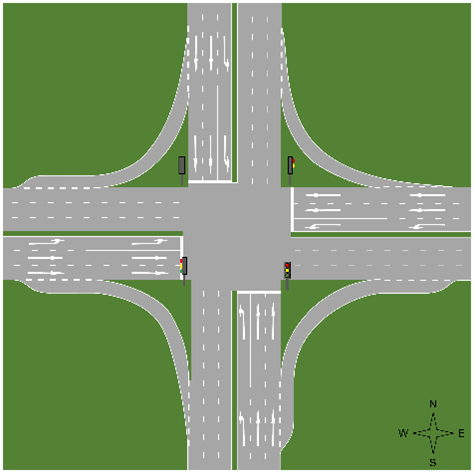
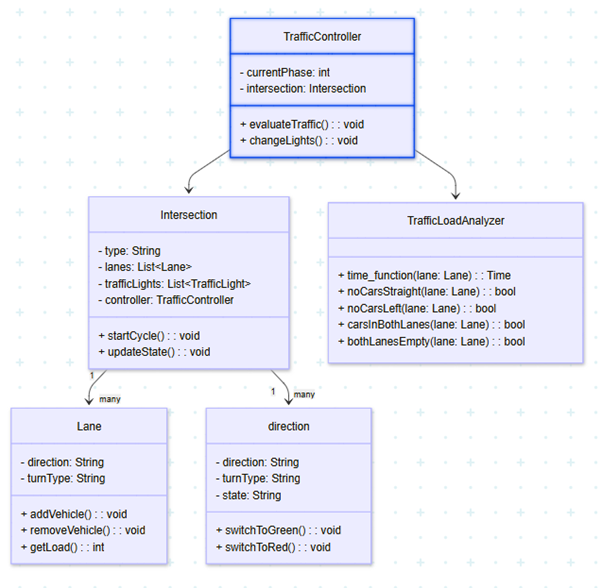
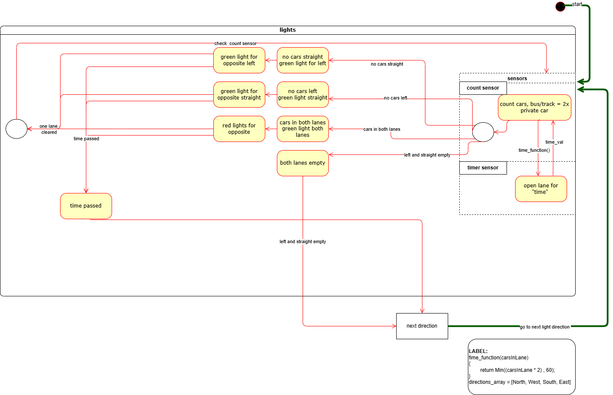

#  Smart Traffic Light Management System

> An intelligent, real-time traffic management simulator designed to optimize intersection flow using dynamic load analysis and state-machine-based controllers.

---

##  About The Project

This project simulates a signalized cross intersection experiencing variable traffic loads from multiple directions. Unlike static, timer-based systems, this smart controller receives real-time vehicle entry data to calculate the optimal green light distribution. The system strictly adheres to rules regarding traffic load, queue management, and maximum allowable delays to ensure smooth and safe transit.



###  Key Features

* **Dynamic Load Analysis:** Utilizes simulated count sensors (weight/camera/laser) to measure vehicle volume in each lane.
* **Smart Prioritization:** Accurately calculates green light duration based on active queues, treating large vehicles (buses/trucks) as two standard private cars for capacity planning.
* **Intelligent Routing Algorithm:** Manages a continuous cycle (North ➔ West ➔ South ➔ East), with built-in logic to safely open opposite lanes if a primary lane is empty, maximizing intersection throughput.
* **Behavior-Driven Development (BDD):** Core user stories and edge cases are thoroughly tested using Cucumber.

---

##  Architecture & Design

The system is built on solid Object-Oriented principles and utilizes Statecharts to manage the complex transitions of traffic light phases.

### Class Diagram



### State Machine Logic (Statechart)

The intersection operates on a 4-way cross model, prioritizing straight and left turns, while right turns remain yielding/open. A fail-safe time limit (e.g., 60 seconds maximum per direction) is enforced to prevent starvation.



---

##  Tools & Methodologies

| Category | Tools / Concepts Used |
| :--- | :--- |
| **System Design** | app.diagrams (draw.io), Mermaidchart |
| **Methodologies** | Behavior-Driven Development (BDD), Object-Oriented Design (OOD) |
| **Behavioral Specs**| Gherkin Syntax (Cucumber) |
| **Documentation** | Markdown, Git & GitHub |

---

##  Behavior-Driven Development (BDD) Scenarios

To validate the architecture, core behaviors are defined using Cucumber (Gherkin syntax).

**Example Scenario: Vehicle passing through the intersection**
```gherkin
Scenario: Vehicle approaching from the west gets a green light
  Given the traffic lights operate in a fixed order (North -> West -> South -> East)
  And the light in the west is currently red
  When the traffic light cycle moves to the west direction
  Then the light in the west turns green
  And the driver safely crosses the intersection
```

**Example Scenario: Dynamic timing by traffic load**
```gherkin
Scenario: Left turn lane is empty
  Given there are vehicles waiting in the straight lane and the left lane is empty
  When there is remaining time allocated for this direction
  Then the opposite straight traffic light will turn green until the time expires
  And drivers safely cross in the opposite direction
```

---

##  How to Explore This Project

As this is an architecture and system design repository, there is no executable source code to compile. To fully understand the system's logic:

1. **Review the Class Diagram:** Understand the Object-Oriented structure and the relationships between the intersection entities.
2. **Follow the Statechart:** Trace the logical flow and decision-making process of the traffic controller based on sensor inputs.
3. **Read the BDD Scenarios:** See how edge cases and dynamic traffic loads are handled in theory using the Gherkin syntax above.

---

##  Future Enhancements

* **Pedestrian Integration:** The system can be extended to account for pedestrians, where a button press at a crosswalk would reduce the green light duration of the other active intersections by 10 seconds.

---

> **Note:** Developed as a Software Engineering academic project. Reference literature for this project includes:
> * [A cloud-based smart traffic management protocol using intelligent traffic light system in VANETs](https://onlinelibrary-wiley-com.ezproxy.hit.ac.il/doi/full/10.1002/cpe.7686)
> * [A Vehicle-Intersection Coordination Scheme for Smooth Flows of Traffic Without Using Traffic Lights](https://ieeexplore-ieee-org.ezproxy.hit.ac.il/document/6907953)
